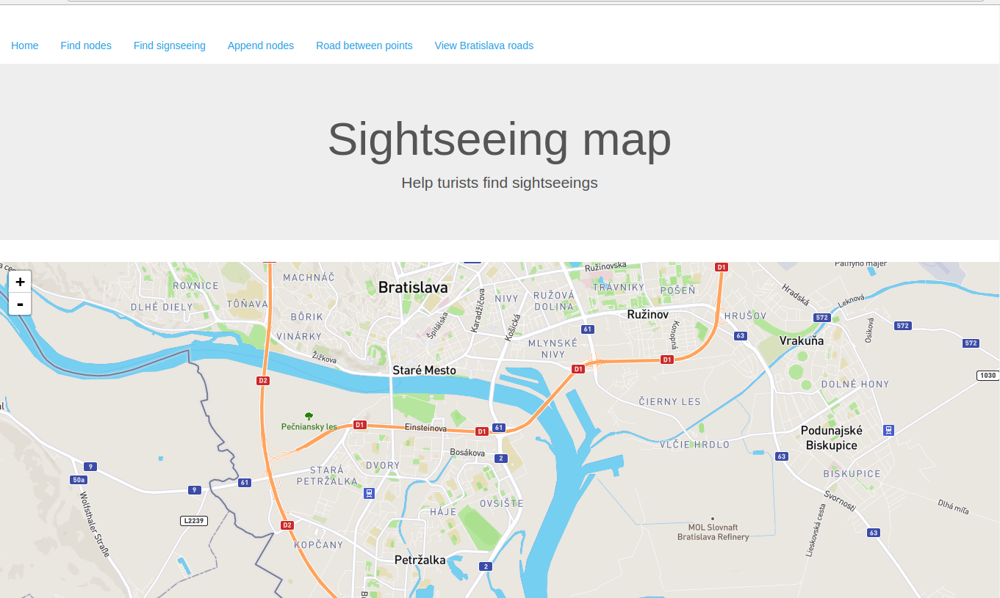

# Špecifikácia práce:

Práca využíva postgresovú databázu s POSTGIS rozšírením. S databázou komunikuje aplikácia naprogramovaná vo framorku Rails. Aplikácia nevyužíva objektovo orientovaný mapovač. Aplikačný kontroler priamo vkladá SQL querry do databázy. Aplikácia na strane klienta využíva javaskriptovú knižnicu Leaflet, ktorá zobrazuje grafické informácie v mape v prehliadači. Data použité v postgresovej databáze sú použité zo stránky OpenStreetMap.org (grafické informácie sú z Bratislavy a jej okolia).

# O aplikácií:

Práca sa bližšie zaoberá vytvorením prototypu aplikácie, ktorá slúži ako pomôcka pre turistov, ktorý si chcú prezrieť pamiatky Bratislavy. Pomocou aplikácie je možné si prezerať a vyhľadavať pamiatky podľa kategórií (hrady, monumenty, bitevné polia, …). Každá z katégórií je v mape vykreslená inou farbou.
Prípady použitia databázy:

1. Aplikácie vyhľadáva historické pamiatkz a zobrayuje ich na mape. Po kliknutí na nejaký z elementov sa vykreslia koordináty a názov pamietky

2. Aplikácia umožnuje medzi dvoma uzlami vyhľadať cestu (Použitý nástroj Leaflet-Route-Machine)

3. Umožnuje pridanie novej pamiatky do databázy

4. Prezerať si uzly v databáze

5. Prezeraž si cesty v databáze 

# Parsovanie dát do databázy:

Portál OpenStreetMap má k dispozícií dáta vo formáte XML s vlastnou štrukúrou (OSM). Parsovanie dát bolo preto vykonávané s použitím nástroja osm2psql. Tento nástroj bol použitý taktiež na importovanie do databázy postgress.

# SQL Dopytovacie commandy:

V dopytoch boli využívané SQL funkcie pre prácu s geometriou. Taktiež  boli často využívané konverzie z google formátu dát (900913) na formát ktorý využíva Leaflet (4326). Takýto spôsob nie je vôbec rozumný, ale cieľom práce je dokázať znalosť v používaní commandov. Všetky výsledky z databázy boli limitované na počet 1000 a to z dôvodu vykresľovanie Leaflet objetov na scéne v prehliadači.  

### Zobrazenie objektov v polygóne:

SELECT p.name, ST_AsGeoJSON(ST_Transform(p.way, 4326)) FROM planet_osm_line  p
WHERE ST_Contains(ST_MakePolygon(ST_GeomFromText('LINESTRING(
x1 y1,  
x2 y2,  
x3 y3,  
x4 y4,  
x5 y5 )', 4326)), ST_Transform(p.way, 4326))
LIMIT 1000

### Vloženie elementu:

V dtabáze pri vkladaní elementu bolo ptrebné unikátne ID. Tento problém bol rešený nájdením najvyššieho ID a uložením hodnoty ID plus 1 ako identifikátora elementu.

INSERT INTO planet_osm_point (osm_id, name, historic, way) VALUES (CAST( (SELECT Max(p.osm_id) FROM planet_osm_point p) AS BIGINT) + 1, 'TestPamiatky', 'memorial', 
 ST_Transform(ST_GeomFromText('POINT(x1 x2)', 4326), 900913))
RETURNING osm_id

Dalšie SQL commandy využívali podobné správanie ako vyššie spomenuté.

# Komunikácia Client-Server

Klient si na na začiatku komunikácie stiahne zo servera potrebné js, css, html súbory. V prípade kliknutia na určité tlačidlo sa Ajax vytvorí požiadavku na určitú metódu na serveri, server vyvolá SQL dopyt. Výsledok dopytu sa odošle clientovy. Grafické dáta sa odosielajú vo forme GeoJSON. Databáza tieto dáta konvertuje na tento formát. Klientskej aplikácií príde výsledok a tá využije načítanú js knižnicu Leaflet a zobrazí dáta na mape buď vo forme čiar, alebo markerov. 

# Rails server API
Railsová aplikácia reaguje na isté typy metód. Vychádzajúce dáta sú v JSON formáte:

find_points, insert_node, find_paths:
[{ „name“ : „name“, „st_geodata“ : „geojson from database“}, ...]

find_points_historic:
[{ „name“ : „name“, „historic“ : „type“, „st_geodata“ : „geojson from database“}, ...]
